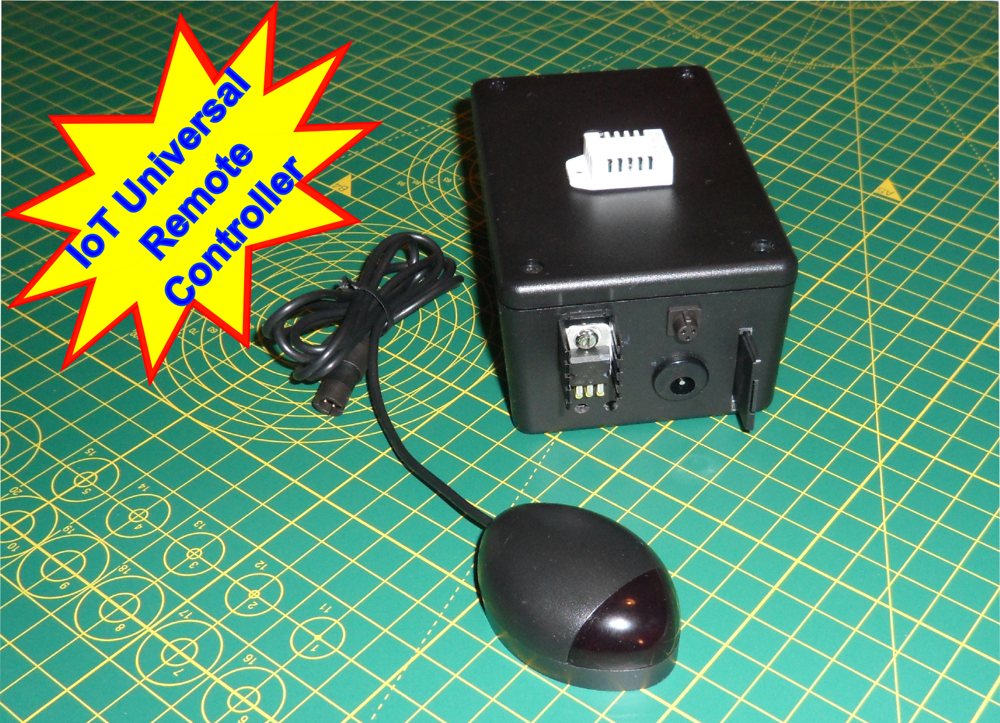
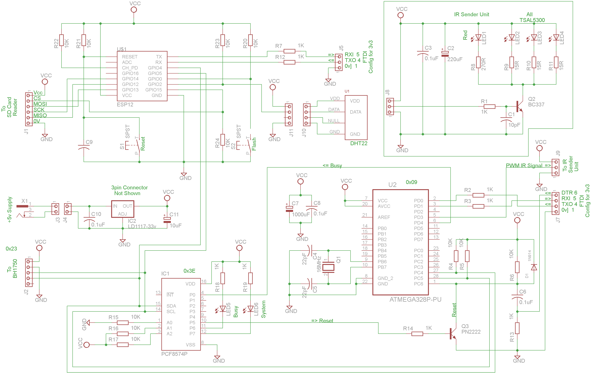

# IoT-Universal-IR-Remote-Controller

Universal IR Remote Controller Using the ESP8266-12E

### The IoT Universal Remote Controller

### Full circuit diagram

This repository holds the details on how to create an IoT Universal Remote Control Device and is part of a series on IoT and home automation [here](https://www.instructables.com/id/Home-Automation-12/).

By Steve Quinn

Written to support the following Instructable;

https://www.instructables.com/id/IR-Remote-Control-Via-IoT-Part-10-IoT-Home-Automat